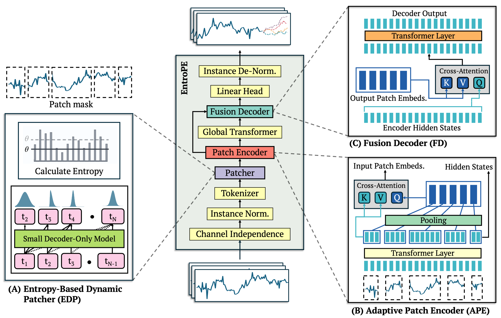
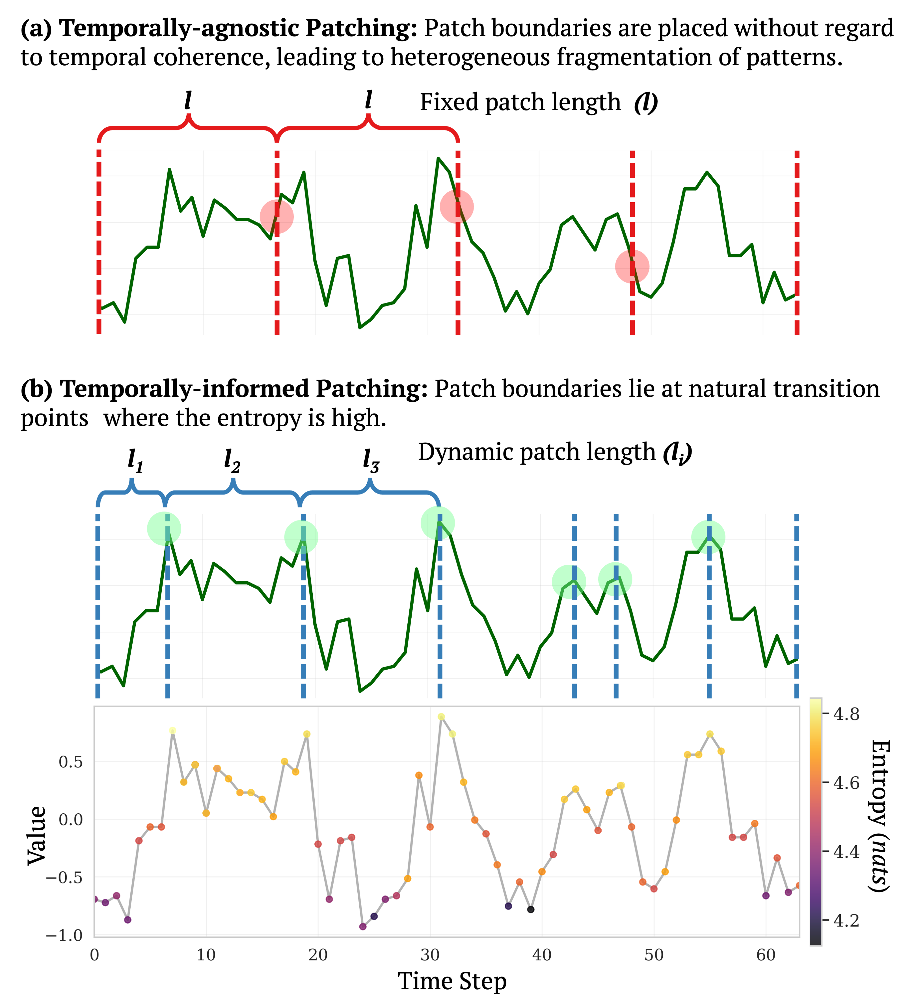

# EntroPE: Entropy-Guided Dynamic Patch Encoder for Time Series Forecasting

This repository contains the official implementation of the paper:
> **EntroPE: Entropy-Guided Dynamic Patch Encoder for Time Series Forecasting**  
> *Under review.*

---

# Overview

**EntroPE** introduces a novel framework for temporally-informed dynamic patching in time series forecasting using Transformer models. Unlike conventional fixed-length patching schemes that arbitrarily segment temporal sequences, our method uses information-theoretic principles to identify natural transition points and dynamically place patch boundaries where predictive uncertainty is highest.

## Architecture



*Comprehensive architecture of EntroPE. The model processes input through: (A) Entropy-Based Dynamic Patcher - A small causal transformer calculates entropy at each time point to identify boundaries where predictive uncertainty is high; (B) Adaptive Patch Encoder - Cross-attention layers aggregate intra-patch dependencies into fixed-size global embeddings; (C) Fusion Decoder - Cross-attention combines global patch context with local encoder hidden states for accurate forecasting.*

## Dynamic vs. Static Patching



*Comparison between traditional static patching (top) and our entropy-driven dynamic patching approach (bottom). Dynamic patches adapt to the inherent temporal structure and complexity of the time series data.*

## Key Innovation

By leveraging entropy measurements to guide patch boundary placement, EntroPE creates semantically meaningful segments that respect the natural temporal structure of time series data. This approach leads to more effective representation learning and improved forecasting performance compared to traditional fixed-size patching methods.

---

## Key Contributions

- **Entropy-Based Dynamic Patcher (EDP)**  
  Uses conditional entropy from a lightweight causal transformer to identify temporal transition points and place patch boundaries at positions with high predictive uncertainty.

- **Adaptive Patch Encoder (APE)**  
  Employs pooling and cross-attention mechanisms to encode variable-length patches into fixed-size representations while preserving intra-patch dependencies.

- **Temporally-Informed Architecture**  
  Preserves temporal coherence by respecting the natural structure of time series data, addressing train-inference mismatch and boundary fragmentation issues.

---

## Architecture

EntroPE consists of three main components:

1. **Entropy-Based Dynamic Patcher**: Computes entropy at each time point using a pre-trained lightweight transformer and applies dual-threshold boundary detection
2. **Adaptive Patch Encoder**: Converts variable-length patches into fixed-size embeddings through pooling and iterative cross-attention refinement  
3. **Fusion Decoder**: Combines global patch context with local encoder hidden states using cross-attention for accurate forecasting

---

## Installation

```bash
# Install dependencies
conda create --name entrope python=3.10
conda activate entrope
pip install -r requirements.txt
```

---
## Experiments

### Datasets

We evaluate on 7 benchmark datasets:
- **ETT family**: ETTh1, ETTh2, ETTm1, ETTm2 (Energy)
- **Weather**: Meteorological data 
- **Electricity**: Power consumption
- **Exchange Rate**: Currency exchange rates

### Reproduction

```bash
# Run specific dataset
sh scripts/etth1.sh
```

### Results Summary

EntroPE achieves significant improvements over existing methods:
- ~20% improvement on ETTh1 compared to PatchTST
- ~15% improvement on Electricity dataset
- ~10% average improvement across all benchmarks
- Better computational efficiency through dynamic patching

---

## Key Features

### Dynamic Boundary Detection
- Information-theoretic approach using conditional entropy
- Dual-threshold mechanism (global + relative thresholds)
- Respects temporal causality and predictive difficulty

### Adaptive Encoding
- Handles variable-length patches efficiently
- Cross-attention refinement preserves intra-patch dependencies
- Fixed-size output suitable for transformer processing

### Efficiency Benefits
- Reduces token count through intelligent boundary placement
- Maintains computational tractability
- Scales well with sequence length

---

## Configuration

### Model Parameters

```yaml
learning_rate: 0.001
batch_size: 64
train_epochs: 20
patience: 7
dropout: 0.1
dim: 8
multiple_of: 64   # ff-dim 
heads: 2
layers: 1
batch_size: 32
learning_rate: 0.01
dropout: 0.01
monotonicity: 1
patching_threshold: 0.2
patching_threshold_add: 0.01
max_patch_length: 24
train_epochs: 10
patience: 10
```

### Threshold Selection
- **threshold_global**: Controls patch granularity (higher = fewer patches)
- **threshold_relative**: Controls sensitivity to entropy changes
- Robust across range [0.15, 0.55] for most datasets

---

## Evaluation Metrics

- **MSE**: Mean Squared Error
- **MAE**: Mean Absolute Error  
- **Efficiency**: MACs (Multiply-Accumulate Operations)

---

## Reproducibility

All results can be reproduced using:
- Fixed random seeds (5 different seeds reported)
- Complete hyperparameter configurations provided
- Environment specifications included
- Multiple GPU platform compatibility

Tested on (Only single-GPU settings):
- NVIDIA RTX 4090
- NVIDIA RTX A5000  
- NVIDIA GeForce RTX 4090 D
- NVIDIA RTX 6000 Ada-16Q

---

## License

This project is licensed under the Apache License - see the LICENSE file for details.

---
## Acknowledgments

This work builds upon and is inspired by several key contributions in the field:

### Foundational Work
- **PatchTST**: Our approach is built on the foundation of PatchTST and other patch-based time series transformers, which demonstrated the effectiveness of patch-based architectures for time series forecasting.

```bibtex
@inproceedings{Yuqietal-2023-PatchTST,
  title     = {A Time Series is Worth 64 Words: Long-term Forecasting with Transformers},
  author    = {Nie, Yuqi and
               H. Nguyen, Nam and
               Sinthong, Phanwadee and 
               Kalagnanam, Jayant},
  booktitle = {International Conference on Learning Representations},
  year      = {2023}
}
```

### Dynamic Patching Inspiration
- **Byte Latent Transformer**: Our dynamic patching approach draws inspiration from advances in NLP, particularly the Byte Latent Transformer's innovative approach to variable-length tokenization.

```bibtex
@article{meta_blt,
  author    = {Artidoro Pagnoni and Ram Pasunuru and Pedro Rodriguez and 
               John Nguyen and Benjamin Muller and Margaret Li and 
               Chunting Zhou and Lili Yu and Jason Weston and 
               Luke Zettlemoyer and Gargi Ghosh and Mike Lewis and 
               Ari Holtzman and Srinivasan Iyer},
  title     = {Byte Latent Transformer: Patches Scale Better Than Tokens},
  url       = {https://github.com/facebookresearch/blt},
  year      = {2024}
}
```

### Evaluation and Implementation
- **TimeKAN Benchmarking Suite**: Our evaluation framework is adapted from the TimeKAN benchmarking suite, providing robust and standardized performance metrics.

- **nanoGPT**: The Entropy Model GPT-2 architecture implementation partially incorporates code from Andrej Karpathy's nanoGPT implementation. We gratefully acknowledge this clean and educational codebase.
  - Repository: https://github.com/karpathy/nanoGPT

---

We thank the authors of these works for their contributions to the open-source community and for advancing the state of the art in time series forecasting and transformer architectures.
---
