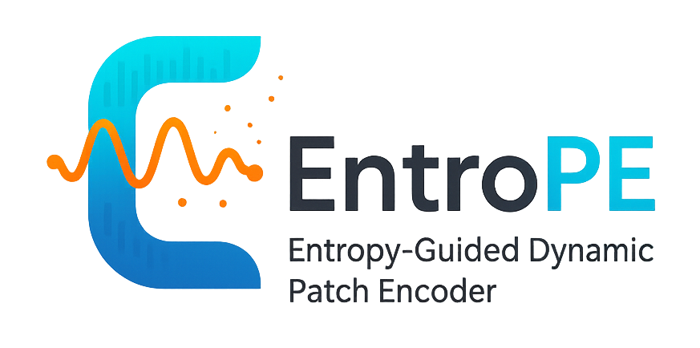

<div align="center">

</div>

# Entropy-Guided Dynamic Patch Segmentation for Time Series Transformers

---

## Installation

```bash
# Create environment
conda create --name entrope python=3.10
conda activate entrope
pip install -r requirements.txt
```

---

## Experiments

### Datasets
We evaluate on 7 benchmark datasets:
- **ETT family**: ETTh1, ETTh2, ETTm1, ETTm2 (Energy)
- **Weather**: Meteorological data 
- **Electricity**: Power consumption

### Quick Start
```bash
# Run specific dataset
sh scripts/ETTh1.sh
```
---

## License

This project is licensed under the Apache License - see the LICENSE file for details.

---
